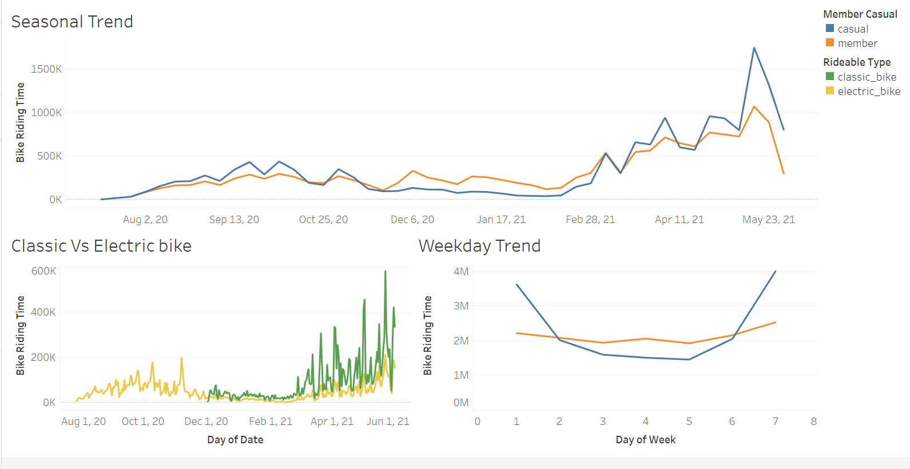
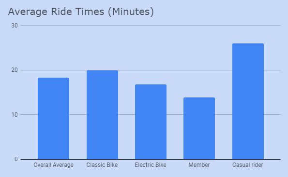

# Analyzing Bike Sharing Data
## How can we convert casual bikers to members?
A bike sharing company in Chicago collected data on their
bikeriders.
They would like to use this data to find out the best way to 
change any *casual* rider to a member.
This conversion is assumed to be easier than acquiring completely new customers because we already have data on the casual riders.
*Especially that they ride bikes.*

## Collecting data
Data was retrieved from [Divvy-tripdata](https://divvy-tripdata.s3.amazonaws.com/index.html).
I chose the following metrics out of the dataset for my analysis:
- Rider Type.
- Bike Type (electric, classic, handicap accessible).
- Start and end timestamps.
- Start and end locations.

## Cleaning The Data
- Cleaned null values
- Corrected incorrect time data (bike returned earlier than taken out)
- Trim Whitespace
- Standardized column type for each month
** Overall the data was well maintained**
## Organization
I utilized SQL to 
- Combine the 12 .csv's **June 2020 Until May 2021**
- Created two new varibles, total_bike_time and date 
- Further filter out any anomolies

SELECT *, DATE_DIFF(ended_at, started_at, minute) AS total_bike_time,
CAST(started_at AS DATE) AS Date
FROM `ancient-figure-315513.bike_data.bike_project`
WHERE rideable_type != 'docked_bike' AND total_bike_time > 0
## Analyzing Data

With the organized data, I used tableau to create a Viz
We can see the comparison of 
- Members and Casual riders throught the year (seasonal affect on bikeriding)
- Members and Casual riders by day of week (Weekend vs Weekday)
- Types of bikes preffered (Classic vs Electric)

## Key Takeaways
### There is an obvious seasonal trend - more bikeriders in the warmer weather
### Since the introduction of classic bikes there has been a clear prefference for it
### More members use the service on weekdays while casual ridership spike on the weekends

## Conclusion
There seems to be an important connection between weekday ridership and members 
The bikes may be a way for people to commute to work 
I would suggest focused advertising on the casual riders that used the service between monday and friday. 
The content of the advertisement would be a young proffesional in a suit or other business attire, riding a bike to work.
This will appeal to the riders that seem to use the bike to travel and not just pleasure (like the weekend users) and will "normalize" biking to work and thus increase membership rates.

