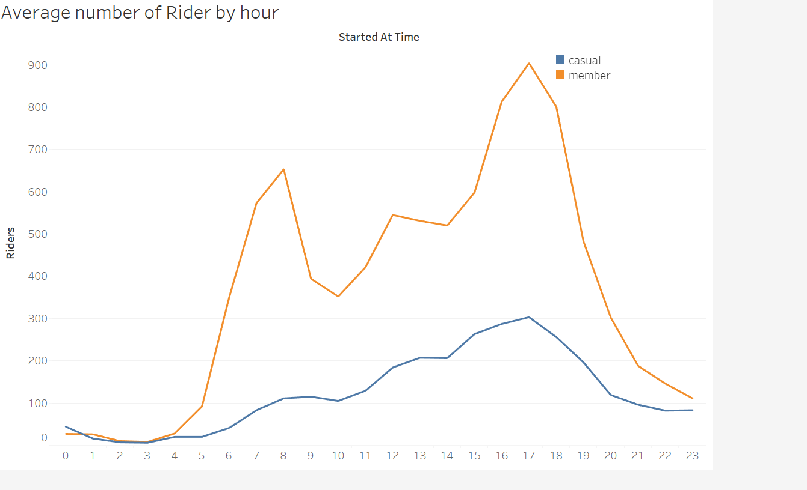

# Analyzing Bike Sharing Data
## How can we convert casual bikers to members?
A bike sharing company in Chicago collected data on their
bikeriders.
They would like to use this data to find out the best way to 
change any *casual* rider to a *member*.
This conversion is assumed to be easier than acquiring completely new customers because we already have data on the casual riders.
*Especially that they ride bikes.*

## Collecting data
Data was retrieved from [Divvy-tripdata](https://divvy-tripdata.s3.amazonaws.com/index.html).
I chose the following metrics out of the dataset for my analysis:
- Rider Type.
- Bike Type (electric, classic, handicap accessible).
- Start and end timestamps.
- Start and end locations.

## Cleaning The Data
- Cleaned null values and trim whitespace
- Corrected incorrect time data (bike returned earlier than taken out)
- Standardized column type for each month
>**Overall the data was well maintained**
## Organization
I utilized Alteryx to 
- Combine the 12 .csv's **June 2020 Until May 2021**
- Created two new varibles, total_bike_time and date 
- Further filter out any anomolies

SELECT *, DATE_DIFF(ended_at, started_at, minute) AS total_bike_time,
CAST(started_at AS DATE) AS Date
FROM `ancient-figure-315513.bike_data.bike_project`
WHERE rideable_type != 'docked_bike' AND total_bike_time > 0
## Analyzing Data

With the organized data, I used tableau to create a Viz
We can see the comparison of 
- Members and Casual riders throught the year (seasonal affect on bikeriding)
- Members and Casual riders by day of week (Weekend vs Weekday)
- Types of bikes preffered (Classic vs Electric)

## Key Takeaways
### Top - seasonal trend - more riders in the warmer weather.
### Bottom left - a clear preference for the classic bike.
### Bottom Right - Weekend for Casual, Weekdays for Members.

## Discussion
There is an important connection between weekday ridership and Members. 
The bikes may be a way for people to commute to work, I will take data from the dataset to see when the majority of rides take place.
A influx of riders on weekdays during rush hours means that weekday riders are using the service for commuting.
If this is true we will want to convert *Casual* bike commuters to *Members* because it is more profitable to the company.
## Further Analysis
### I ran another search on Bigquery:
SELECT  date, started_at,ended_at, CAST(started_at AS TIME) AS started_at_time,CAST(ended_at AS TIME) AS ended_at_time, member_casual
FROM `ancient-figure-315513.bike_project.bike_info`
WHERE rideable_type != 'docked_bike' AND total_bike_time > 0 AND date != '2020-12-15'
### With this new dataset I was able to make another graph

### The orange *"Member"* shows two peaks one at 8 AM and a second higher one at 5 PM. 
This suggests that Members use their bikes for commuting.
### Suggestions
1. We want to convert our casual riders to full-time members.
2. A significant use for the service is commuting.
3. We have to appeal to the commuting side of our casual riders.
- One possible campaign that is in line with my analysis is:
*The content of the advertisement would be a young proffesional in a suit or other business attire, riding a bike to work.
This will appeal to the riders that seem to use the bike to travel and not just pleasure (like the weekend users) and will "normalize" biking to work and thus increase membership rates.*

